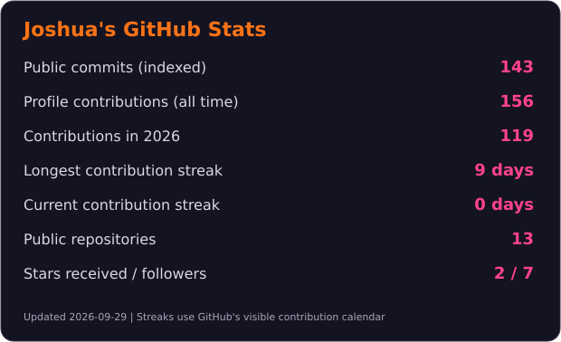
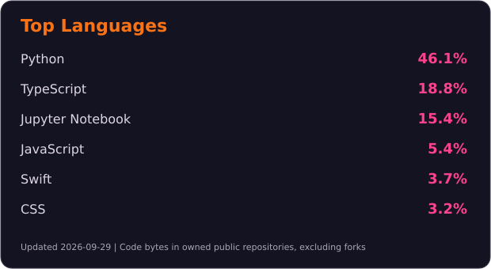

# Hi, I'm Joshua Nehohwa 👋

**Junior Software Developer | Full-stack, backend and data projects**  
Cape Town, South Africa · Final-year BSc IT (Software Engineering), Eduvos

I build practical software across web, backend, mobile and data applications. My work includes a live community website and connected registration workflows for KuCoNa, a basketball analytics application, and a PHP/MySQL marketplace.

I have completed web development and digital systems internships with HexSoftwares and Nature's Valley Trust / KuCoNa. I also chair the Vossie DevClub, where I help students learn by building.

**Open to junior software development opportunities in Cape Town or remotely within South Africa.**

[LinkedIn](https://www.linkedin.com/in/joshua-nehohwa-b4b97b229/) · [Portfolio source and case studies](https://github.com/jnehohwa/joshua-portfolio) · [Email](mailto:nehohwajoshua@gmail.com)

## Selected Projects

| Project | What I built | Technologies | Explore |
| --- | --- | --- | --- |
| **KuCoNa Digital Operations** | Live community website, programme pages, and connected registration and staff workflows | WordPress, Elementor, Jotform, Make.com, Airtable | [Live website](https://kucona.org.za/) · [Case study](./case-studies/kucona/README.md) |
| **CourtVision AI** | Replay-first basketball analytics with predictions, a shot map, WebSocket updates and recovery tests | FastAPI, Next.js, SwiftUI, PostgreSQL, Redis | [Source](https://github.com/jnehohwa/courtvision-ai) · [Screenshots and demo guide](./case-studies/courtvision/README.md) |
| **KasiSwap** | Academic C2C marketplace with buyer, seller and admin workflows | PHP, MySQL, JavaScript, Docker | [Source](https://github.com/jnehohwa/kasiswap-php-mysql-deliverable-2) · [Website](https://kasiswap.free.nf/) |
| **PitchPredict** | Football prediction models with chronological backtesting and an explainable Poisson baseline | Python, FastAPI, React, pandas, scikit-learn, XGBoost | [Source and model findings](https://github.com/jnehohwa/pitch-predict) |
| **TripBuddy** | Android travel planning, budget tracking and photo memories with local persistence | Kotlin, Android, Room | [Source](https://github.com/jnehohwa/TripBuddy2) |
| **HexSoftwares Web Scraper** | Book-data extraction with CLI/GUI workflows, retries, logging and CSV/SQLite export | Python, Requests, BeautifulSoup, SQLite | [Source](https://github.com/jnehohwa/HexSoftware_WebScraper) |

CourtVision is a local demo with synthetic replay fixtures; public hosting is still pending. KuCoNa is a delivered WordPress and digital operations project, documented here as a case study.

## CourtVision Preview

## Technologies I Use

- **Languages:** Python, TypeScript, JavaScript, PHP, Kotlin, Swift, SQL
- **Web and APIs:** React, Next.js, FastAPI, HTML, CSS, WordPress, Elementor
- **Data and persistence:** PostgreSQL, MySQL, SQLite, SQLAlchemy, pandas, scikit-learn
- **Tools and workflows:** Git, Docker, GitHub Actions, Redis, Airtable, Jotform, Make.com
- **Mobile:** Android, Room, SwiftUI

## Beyond the Code

Basketball, running and anime keep me going. Stephen Curry is my favourite player, and my interest in sports is part of what led me to build CourtVision and PitchPredict. 🏀

## GitHub Stats

 

Updated daily. Commit counts cover public commits indexed by GitHub Search. Streaks use the visible GitHub contribution calendar, including issues and pull requests. Language percentages measure code bytes in my own public repositories, excluding forks.
